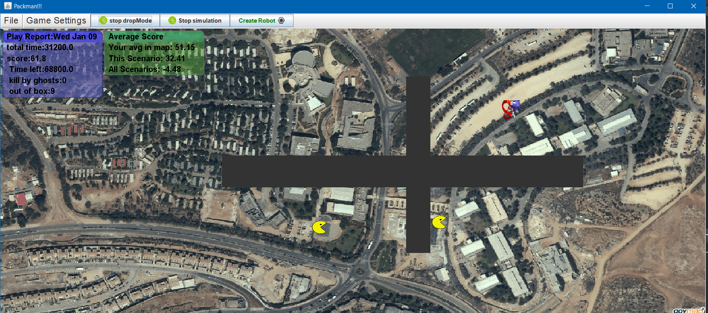
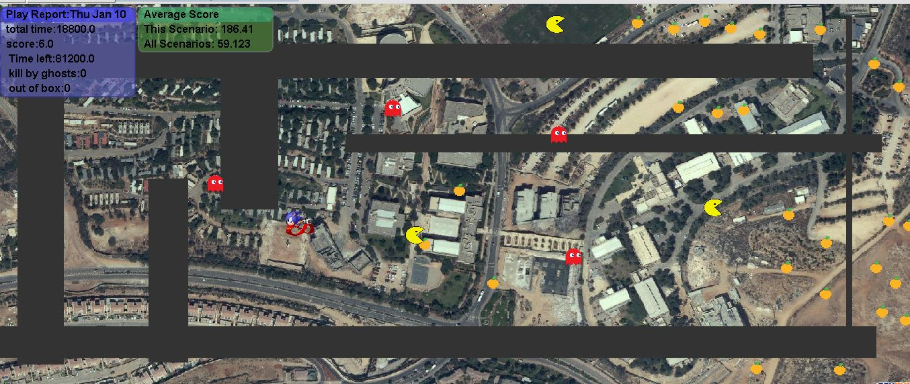
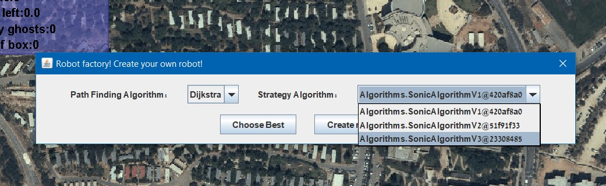

# What is it?
This is a Multi-pacman game simulation over Google Earth!  
You can fork this repisoritory and add new GameObjects by yourself!

## Demos
### Ariel University

  

 
## Contributors:
- Ofek Bader:
	-   -> https://github.com/neyney10
- Adi Lichy:
	-   -> https://github.com/Lichy24

# How to play the game?

## Game goals and notes
the goal in this game is to eat as many fruits as you can before time runs out, and thier are also evil pacmans which are try to eat your fruits, ghost which are trying to kill you as well! isn't it exciting?
the game will end if thier are no more fruits or time runs out. if you are able to end the game before time runs out you will get bouns time points to your score, every fruit and pacman can be eat and give you one(1) point.
beware of obstecales which are harmful to you.
Ghost- will chase you if a ghost kills you lose 20 points.
Box - will block your path and need to go around it if player touchs box lose 1 point.

## How to actually play?

### Manual
 - <u>Step 1:</u> Choose placment of Sonic(Player)  by pressing the GameObject menu clicking on sonic which is label "The choosen one". 
- <u>Step 2:</u> Click any were on the map to place the Sonic(Player). 
- <u>Step 3:</u> Press Run(M) to run manual. the Sonic will start running. 
- <u>Step 4:</u> Controlling the Sonic(Player) by clicking on the map Sonic orientation will be change to face the mouse click position. 

### Automatic  Robot
- Step 1: Press on create robot which will a popup will apper their you will choose the robot algortihm to work with, if not choosed will use default algorithm. 
- Step 2: Press Run(A) will initiate the game and the Auto Player will pick his start position and will go to eat fruits.  

# Running example 8 
<u>Our toughts:</u> We decide on algorithm while search for a fruit and not interrupt other pacman which going to thier fruits while also passing obstacles and avoid ghosts. 
 <u>Run:</u> While running the game player is going trough each fruit while moving around the obstacles ,racing the other pacmans and avoid the ghosts to not lose points. 
 <u>Result:</u> End game results the player scored atotal of 62.4 which is an amazing score to achieve. 

# How to load a saved CSV game file
- <u>Step 1:</u> go to the toolbar and select the "File" menu.  

- <u>Step 2:</u> select "Load game".  

- <u>Step 3:</u> select the game file you want to load!

Note: make sure that the CSV file (if not generated by the game) to be in this format:  

# Our Wiki Descrption
Link of wiki: https://github.com/neyney10/PackmanV2/wiki  
 in the wiki you may read on our algortihm of Player(Sonic) and Desgin of automatic robots. 

# Manual and auto scores
our game scores for auto and manual playing each scenario has different layout for the player to complete  
and at the end of every game will get a score, to rate his gameplay. 

- Example 1:  Manual: 27.6 Auto: 53.5   
- Example 2:  Manual: 64.2 Auto: 80.9   
- Example 3:  Manual: 45.1 Auto: 54.8   
- Example 4:  Manual: 81.2 Auto: 81.2   
- Example 5:  Manual: 81.2 Auto: 81.2   
- Example 6:  Manual: 12.0 Auto: 13.0   
- Example 7:  Manual: 46.0 Auto: 68.4   
- Example 8:  Manual: 20.0 Auto: 20.3   
- Example 9:  Manual: 21.9 Auto: 23.9   

## Development Status: Released Version 1.0 Beta! see the "Realeases Tab:
## NOTICE: We moved our project managemnet to the "Projects" tabs here on github! check it out! the current list here is deprecated and outdated.
#### Software objectives:
- ~~make player~~ [COMPLETED]
- ~~make ghosts~~ [COMPLETED]
- ~~make black rectangles no go zone.~~ [COMPLETED]
- ~~make "server" like system that the play can play against~~ [COMPLETED]
- ~~database system/data collector~~ [COMPLETED]
- ~~design & develop an autonomous system for playing~~ [COMPLETED]
- ~~game report~~ [COMPLETED]
- ~~update UML~~ [COMPLETED]

#### General objectives:
- ~~Write for each function and class a Javadoc description.~~ [COMPLETED]
- ~~Generate Javadoc folder.~~ [COMPLETED]
- ~~Edit readme.md file to have HOW-TO-USE toturial and software description.~~ [COMPLETED]
